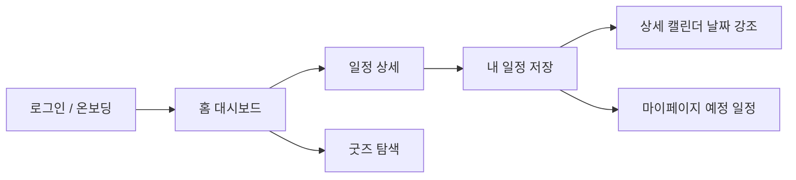
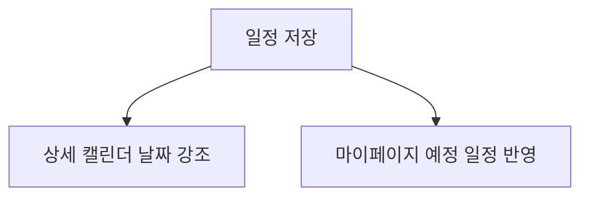

<p align="center">
  
</p>

<p align="center">
  
</p>

<p align="center">
  💥 덕질은 사고처럼 찾아온다 — 그래서 이름도 <b>덕통사고</b>
</p>

<p align="center">
  
  
  
  
  
  
</p>

<p align="center">
팬덤 일정 · 굿즈 오픈 · 마감 정보를 하나의 흐름으로 연결한 React + Express 기반 데모 앱
</p>

---

## 서비스 소개

팬 활동을 하다 보면 공연, 컴백, 굿즈 오픈, 예약 마감 정보가 여러 채널에 흩어져 있어 놓치기 쉽습니다.

**덕통사고**는 팬 활동 정보를  

**홈에서 발견 → 상세에서 이해 → 캘린더와 내 일정으로 관리**

흐름으로 연결한 팬덤 일정 관리 서비스입니다.

로그인 후 취향 키워드를 고르고, 홈에서 추천 일정과 곧 마감 항목을 확인한 뒤  
상세 캘린더와 굿즈 탐색 화면으로 이어지는 구조를 데모 형태로 경험할 수 있습니다.

---

## 서비스 흐름



---

## 발표용 요약

### 문제

팬덤 일정, 굿즈 오픈, 예약 마감 정보가 여러 채널에 흩어져 있어 놓치기 쉽습니다.

### 해결

홈에서 발견하고, 상세에서 이해하고, 캘린더와 내 일정으로 관리하는 흐름을 하나의 앱으로 묶었습니다.

### 핵심 포인트

- 일정 저장 후 상세 캘린더 날짜 강조
- 곧 마감 카드의 잔여 시간 시각화
- 굿즈 탐색 / 홈 검색 / 일정 상세가 하나의 흐름으로 연결됨

---

## 주요 기능

### 홈 대시보드

- 오늘의 덕질 문장 랜덤 노출
- 구독 키워드 기반 일정 추천
- 곧 마감 카드 강조 UI
- 홈 검색 결과 제공

`곧 마감` 카드는 마감일이 가까워질수록 색이 진해지고  
`오늘 마감`, `D-n` 배지가 표시됩니다.

---

### 상세 캘린더

- 월간 캘린더 + 날짜별 일정 리스트
- 검색어 / 카테고리 / 출처 유형 / 관심 키워드 필터
- 저장한 일정 날짜 하이라이트



---

### 일정 상세 페이지

- 일정 핵심 정보 확인
- OpenAI 요약 또는 규칙 기반 fallback 요약
- 내 일정 저장
- 좋아요 / 링크 복사 / 외부 링크 이동

기존 `.ics` 다운로드 대신  
로컬 **내 일정 저장 흐름**으로 동작합니다.

---

### 굿즈 탐색 페이지

- 예약 / 현장 판매 / 재입고 흐름 탐색
- 판매 방식 / 출처 / 관심 키워드 필터
- 굿즈 카드 기반 탐색 UI

---

### 마이페이지

- 프로필 카드
- 저장한 예정 일정 목록과 페이지네이션
- 일정 삭제 기능
- 처음 선택한 취향 키워드 확인

---

## 수요일 발표 이후 추가 구현

- 홈 / 상세 캘린더 / 굿즈 탐색 히어로 영역을 감성 카피 + 일러스트 카드 구조로 개선
- 일정 상세의 `내 캘린더 추가`를 `.ics` 다운로드 대신 로컬 `내 일정` 저장 흐름으로 변경
- 저장한 일정이 상세 캘린더 날짜 하이라이트와 마이페이지 예정 일정 목록에 함께 반영되도록 연결
- 저장된 일정 상태에서는 CTA가 `상세 캘린더에서 보기`로 바뀌고 해당 날짜로 이동
- `곧 마감` 카드에 남은 시간 색상 단계와 `오늘 마감`, `D-n` 배지 추가
- 마이페이지를 저장 일정 중심 레이아웃으로 정리

---

## 4분 데모 플로우

### 1. 문제와 서비스 소개

팬 활동 정보가 일정, 굿즈, 마감 기준으로 흩어져 있다는 문제 설명

### 2. 홈 대시보드

- 오늘의 덕질 문장
- 구독 일정
- 곧 마감 카드

### 3. 일정 상세 → 저장 → 캘린더 반영

- 일정 상세 진입
- `내 캘린더 추가`
- `상세 캘린더에서 보기`
- 해당 날짜 하이라이트 확인

### 4. 마이페이지 / 굿즈 탐색

- 저장 일정 목록 확인
- 굿즈 탐색 페이지 시연

---

## 테스트 케이스 및 검증 결과

### 자동 검증

```bash
npm run typecheck --workspace frontend
```

결과: 통과

```bash
npm run build --workspace frontend
```

결과: 통과

---

### 수동 테스트 케이스

#### 일정 저장 후 캘린더 반영

절차  
일정 상세 → 내 캘린더 추가

기대 결과  
상세 캘린더 날짜 표시 + 마이페이지 일정 반영

결과  
통과

---

#### 상세 캘린더 이동

절차  
상세 → 상세 캘린더 보기

기대 결과  
해당 날짜 자동 선택

결과  
통과

---

#### 곧 마감 카드 강조

절차  
홈 → 곧 마감 카드 확인

기대 결과

- 마감일 가까울수록 카드 색 강조
- `오늘 마감`, `D-n` 표시

결과  
통과

---

## 프로젝트 구조

```
.
├ frontend/   # React 19 + Vite + TypeScript UI
├ backend/    # Express API 서버
└ docs/       # MVP 진행 문서
```

---

## 기술 스택

| 영역 | 기술 |
|-----|-----|
| Frontend | React 19, Vite 6, TypeScript |
| Backend | Node.js, Express |
| AI | OpenAI Responses API |
| State | localStorage 기반 저장 |

---

## 빠른 실행

```bash
npm install
npm run dev
```

frontend  
http://localhost:5173

backend  
http://localhost:4000

---

## 환경 변수

루트 `.env`

```bash
OPENAI_API_KEY=
OPENAI_SUMMARY_MODEL=gpt-4.1-mini
VITE_API_BASE_URL=http://localhost:4000
```

설명

OPENAI_API_KEY  
일정 상세 AI 요약 생성

OPENAI_SUMMARY_MODEL  
요약 모델

VITE_API_BASE_URL  
프론트 API 주소

---

## 데모 로그인

```
email: demo@ducking.club
password: demo1234
```

첫 로그인 시 최소 3개의 취향 키워드를 선택해야 온보딩이 완료됩니다.

---

## 개발 스크립트

```bash
npm run dev
npm run dev:frontend
npm run dev:backend
npm run build
npm run build:vercel
npm run typecheck
```

---

## 확장 포인트

현재 인증 / 사용자 데이터 / 저장 일정은

- in-memory
- localStorage

기반으로 동작합니다.

실서비스 전환 시 다음 영역 교체가 필요합니다.

```
backend/src/repositories/*
backend/src/services/auth-service.js
frontend/src/utils/saved-schedules.ts
backend/src/services/home-web-search-service.js
```

---

## 요약

덕통사고는 흩어진 팬 활동 정보를  

발견 → 이해 → 관리  

흐름으로 연결하는 팬덤 일정 관리 서비스 데모입니다.
